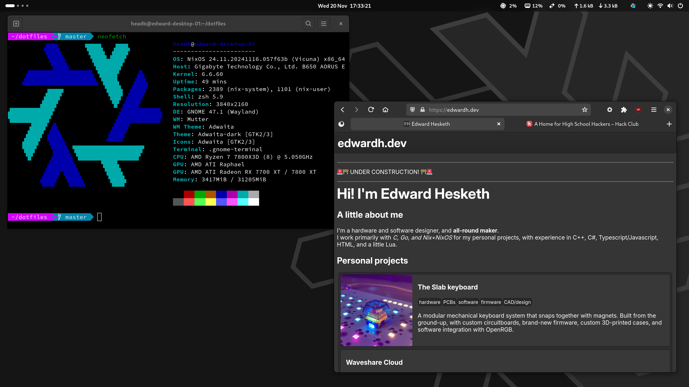
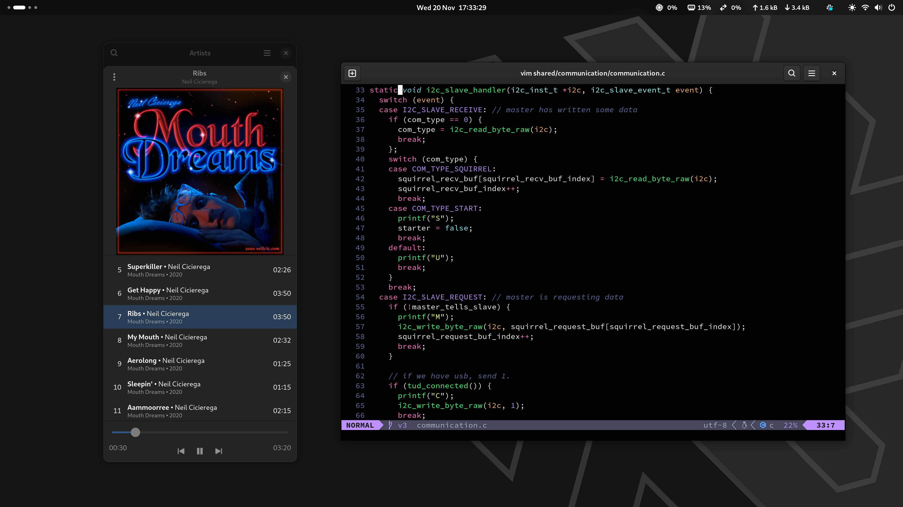
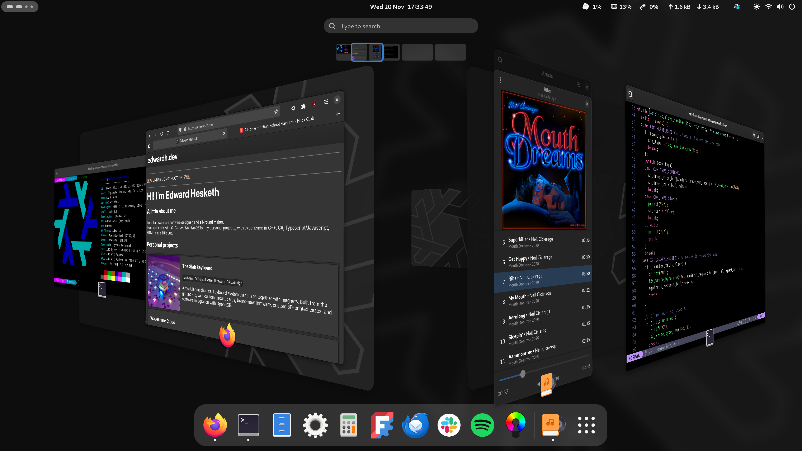

# nixos-network

 [](https://xcfile.dev) 

A continuously updated reproducable config for:
- a desktop workstation
- a mail+calendar+web+DNS server running in AWS ([edwardh](systems/edwardh))
- a laptop (Lenovo Thinkpad)
- a router (old DELL Optiplex machine) ([gateway](systems/gateway))
- a Nix binary cache server running on a Raspberry Pi 5

Where **everything** about my systems is controlled by NixOS in plenty of detail, making for a perfectly-configured install *every time*, down to [the seconds on the clock](https://github.com/headblockhead/nixos-network/blob/dddba60346632e95b1840a7c95379396a8193fd1/modules/nixos/desktop.nix#L125)!

## Table of Contents

  * [Tour](#tour)
  * [Desktop Screenshots](#desktop-screenshots)
  * [Installation](#installation)
  * [Troubleshooting](#troubleshooting)
  * [Tasks](#tasks)

## Tour

Here is an overview of the most important files and folders in my config:

  * [modules/nixos](modules/nixos) is the **most most important** folder, as it contains the core of my configuration (desktop environment/theming, ssh config, git config, zsh config, etc.) as parts that can be included and reused across systems.
  * [systems](systems) contains the individual configurations for each of my systems, importing some of the modules, and adding some per-device extras.
  * [flake.nix](flake.nix) defines the ssh keys used for login across all of my systems, along with the versions of nixpkgs to use, and the files to use for each machine's config.
  * [custom-packages](custom-packages) contains modified versions of existing programs used by me.
  * [neovim](neovim) contains lua-based neovim configuration, [modified from @a-h's config](https://github.com/a-h/dotfiles/tree/3037eb252c0aab44d420c52b61fb98f17c6923a0/.config/nvim/lua).

## Desktop Screenshots





## Installation

### Boot from NixOS installation media

> [!TIP]
> Using the minimal installation media is recommended, as it is smaller and faster to download. However, you cannot use network manager (`nmtui`) to setup wireless networking with the minimal image.

### Set up internet

> [!NOTE]
> If you already have a wired connection, you can skip this step.

```bash
sudo systemctl start wpa_supplicant
sudo wpa_cli
> add_network
> set_network 0 ssid "your_ssid_here"
> set_network 0 psk "your_password_here"
> enable_network 0
> save_config
> quit
```

### Partition and format

> [!CAUTION]
> This deletes your data, check drive names carefully.

```bash
cfdisk /dev/drivename
```

Now, delete all partitions on the disk and create the new partitions:
  - A 525M "EFI System" partition,
  - a "Linux Swap" partition,
  - and a generic "Linux Filesystem" partition to fill the rest of the disk.

First, format the EFI System partition with FAT:

```bash
mkfs.fat -F 32 -n boot /dev/drivename1
```

Then, format the swap partition, giving it the label of 'swap':

```bash
mkswap -L swap /dev/drivename2
```

And finally, format the main Linux Filesystem partition with ext4, giving it the label of 'nixos':

```bash
mkfs.ext4 -L nixos /dev/drivename3
```

These drive labels are used by the system config in [fileSystems.nix](modules/nixos/fileSystems.nix) to avoid hardcoding drive UUIDs.

### Mount to edit.

To edit the contents of the disk, it needs to be mounted into a folder.
First, mount the main Linux Filesystem:

```bash
mount /dev/whatever3 /mnt # Mount root filesystem
```

Then, mount the boot filesystem:

```bash
mkdir -p /mnt/boot
mount /dev/whatever1 /mnt/boot # Mount boot partition
```

Finally, enable the swap:

```bash
swapon /dev/whatever2 # Use the swap partition
```


### First system install.

Generate example configuration as referance.
```bash
nixos-generate-config --root ./
```

> [!NOTE]
> Copy unique parts of the autogenerated `hardware-configuration.nix` to the `hardware.nix` of the system to ensure compatibilty with hardware.

Download this repo. This is stored in a tmpfs, so it will be lost on reboot.
```bash
nix-shell -p git
git clone https://github.com/headblockhead/nixos-network.git
```

> [!WARNING]
> Changes made to this copy of the nixos-network are not saved, so copy changes to the /mnt folder or other means of persistance to avoid pain later.

Build and install. Set a root password, it can be anything as we will disable direct root in a minute.
```bash
cd nixos-network
nixos-install --root /mnt --flake .#HOSTNAME
reboot
```

### Set password and lock root

Use a TTY shell to login as root, then set the user password.

```bash
passwd headb
```

Finally, delete the password for the root user and lock the root account.

```bash
sudo passwd -dl root
sudo usermod -L root
```

### Post-installation

#### GNOME theme for Firefox

source: [firefox-gnome-theme](https://github.com/rafaelmardojai/firefox-gnome-theme)

```bash
curl -s -o- https://raw.githubusercontent.com/rafaelmardojai/firefox-gnome-theme/master/scripts/install-by-curl.sh | bash
```

## Troubleshooting

### Missing boot option

Try [re-installing the bootloader from installation media](https://nixos.wiki/wiki/Bootloader#Re-installing_the_bootloader).
Or move EFI files to generic locations for old BIOSes:
```bash
mv /boot/EFI/NixOS-boot /boot/EFI/boot
mv /boot/EFI/boot/grubx64.efi /boot/EFI/boot/bootx64.efi
```

### No display output after GRUB

Try adding `nomodeset` to the kernel parameters in GRUB.

## Tasks

### nixos

Switch to the new nixos configuration.

```bash
sudo nixos-rebuild switch --flake .# --accept-flake-config
```

### home-manager

Switch to the new home-manager configuration for the current user.

```bash
home-manager switch --flake ".#$USER@`hostname`" 
```

### test-deploy

Deploy the nixos configurations to all machines, without setting the boot-default.

```bash
nixos-rebuild test --target-host gateway --use-remote-sudo --flake .#gateway
nixos-rebuild test --target-host rpi5-01 --use-remote-sudo --flake .#rpi5-01 --fast
nixos-rebuild test --target-host rpi4-01 --use-remote-sudo --flake .#rpi4-01 --fast
nixos-rebuild test --target-host rpi4-02 --use-remote-sudo --flake .#rpi4-02 --fast
nixos-rebuild test --target-host edwardh.dev --use-remote-sudo --flake .#edwardh --fast
```

### rollout

Deploy the nixos configurations to all machines, setting the boot-default.

```bash
nixos-rebuild switch --target-host gateway --use-remote-sudo --flake .#gateway
nixos-rebuild switch --target-host rpi5-01 --use-remote-sudo --flake .#rpi5-01 --fast
nixos-rebuild switch --target-host rpi4-01 --use-remote-sudo --flake .#rpi4-01 --fast
nixos-rebuild switch --target-host rpi4-02 --use-remote-sudo --flake .#rpi4-02 --fast
nixos-rebuild switch --target-host edwardh.dev --use-remote-sudo --flake .#edwardh --fast
```
