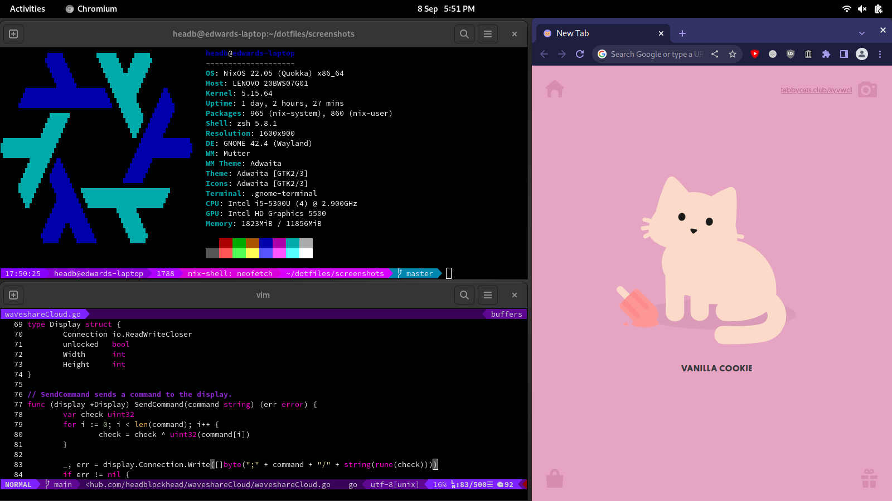
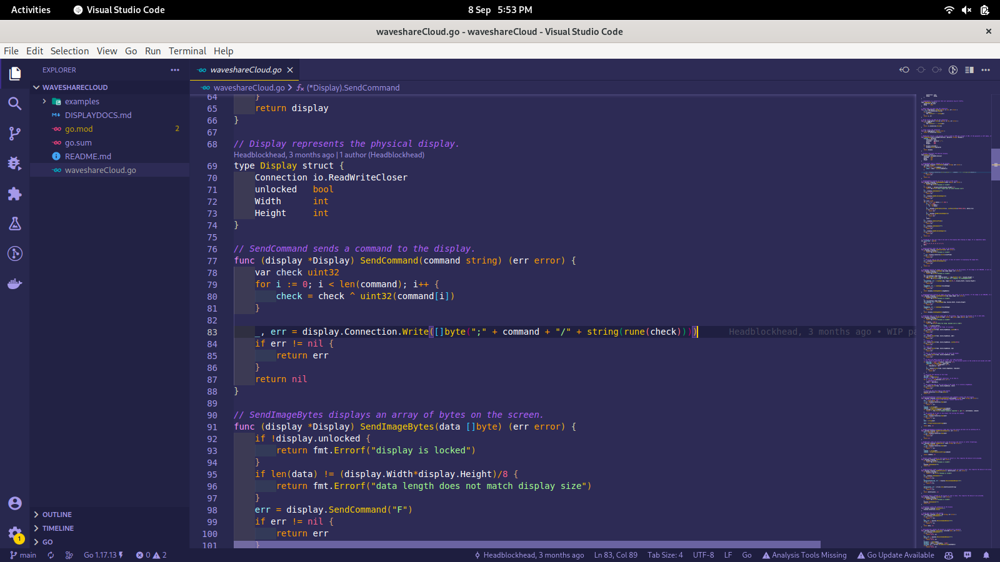
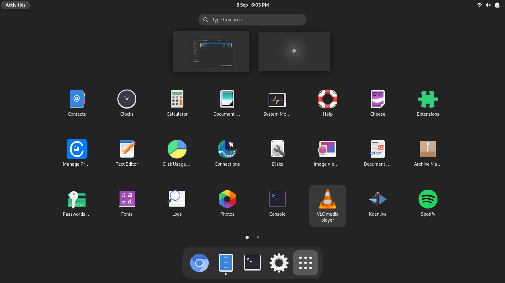

# dotfiles
Dotfiles for my current nixos system. These files configure my OS and applications. Use them as you wish!

## What does it look like?





[see more](./screenshots/)

## What does it use?

The system uses the classic combo of the Gnome desktop manager and the GDM3 display manager. It includes most of the basic Gnome apps along with media editing software and code editing software. In the terminal, it also includes programs such as Neovim, Git (of course), zsh, the Go programming language and more!

## How do I recreate it?

*It's actually surprisingly simple!*

1. Create an install USB.

   Download the nixos stable [setup iso](https://channels.nixos.org/nixos-22.05/latest-nixos-minimal-x86_64-linux.iso).
   Write it to a USB using your prefered USB writing tool.
2. Boot into the USB.

   Once the USB has been written to, reboot and select the new USB from the boot options of your BIOS.
3. Setup the network using Network Manager.

   Using the Network Manager TUI, setup the network. This tool should make it very easy to connect to a wifi network.
   ~~~
   nmtui
   ~~~
4. Partition the drive.

    ~~~
    cfdisk /dev/sda
    ~~~
    I would reccomend deleting all partitions then create:
      - a 525M EFI System partition
      - a Linux Swap partition (I went with 15G as I have 12G of RAM - [size guide](https://itsfoss.com/swap-size/))
      - and a Linux Filesystem partition to fill the rest of the disk.
5. Format the partitions.

    First, format the EFI System partition with FAT
    ```bash
    mkfs.fat -F 32 -n boot /dev/sda1
    ```
    Then, format the swap partition.
    ```bash
    mkswap -L swap /dev/sda2
    ```
    Then, format the Linux Filesystem partition with ext4
    ```bash
    mkfs.ext4 -L nixos /dev/sda3
    ```
6. Mount the newly created partitions.

    First, mount the main Linux Filesystem
    ```bash
    mount /dev/sda3 /mnt
    ```
    Second, mount the boot filesystem
    ```bash
    mkdir -p /mnt/boot
    mount /dev/sda1 /mnt/boot
    ```
    Third, turn on the swap filesystem
    ```bash
    swapon /dev/sda2
    ```
7. Setup the new system config.

    First, generate the default config.
    ```bash
    nixos-generate-config --root /mnt
    ```
    Then, dowload the repo.
    ```bash
    curl -LO https://github.com/headblockhead/dotfiles/archive/refs/heads/master.zip
    unzip master.zip
    cd dotfiles-master
    ```
    Then, copy the system config to the new system.
    ```bash
    cp ./root/etc/nixos/configuration.nix /mnt/etc/nixos/configuration.nix
    ```
    Lastly, install the system
    ```bash
    nixos-install
    ```
